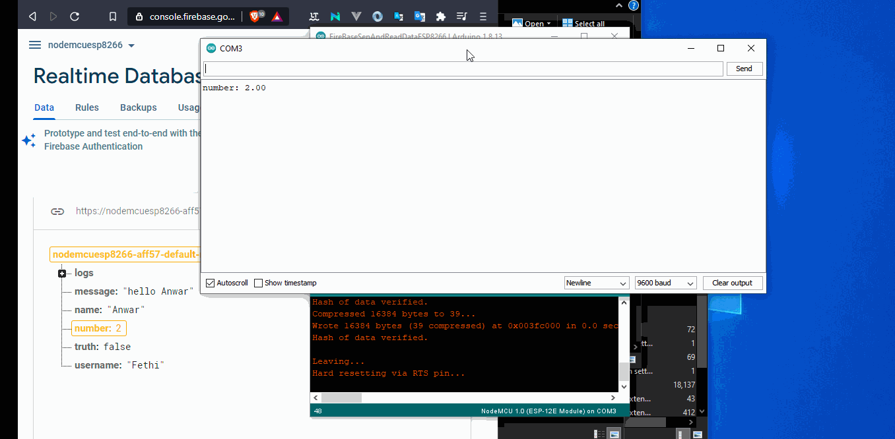
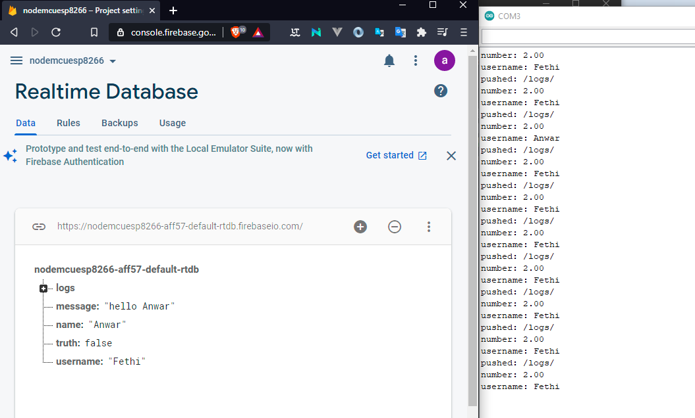

# Send And Read Data Firebase And NodeMcu
 Simple example Using NodeMcu Send And Read DATA With Firebase


### Config : 
#### 1- edit 

```C++
// Set these to run example.
#define FIREBASE_HOST "Your Firebase Host"
#define FIREBASE_AUTH "Your Firebase Key"
#define WIFI_SSID "Your WIFI SSID"
#define WIFI_PASSWORD "Your WIFI PASSWORD"

```

## result :



